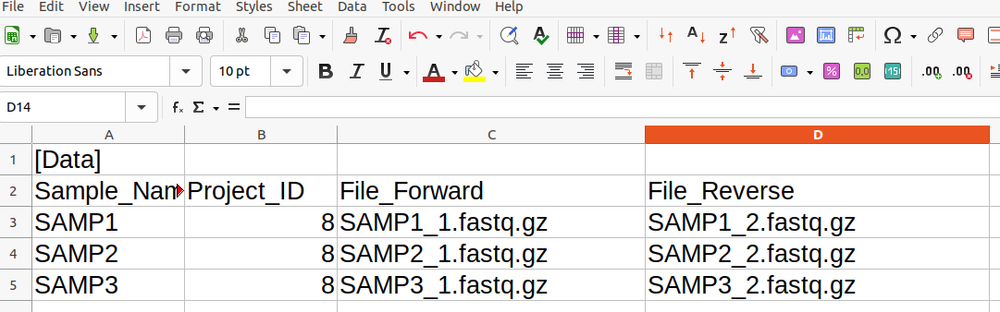
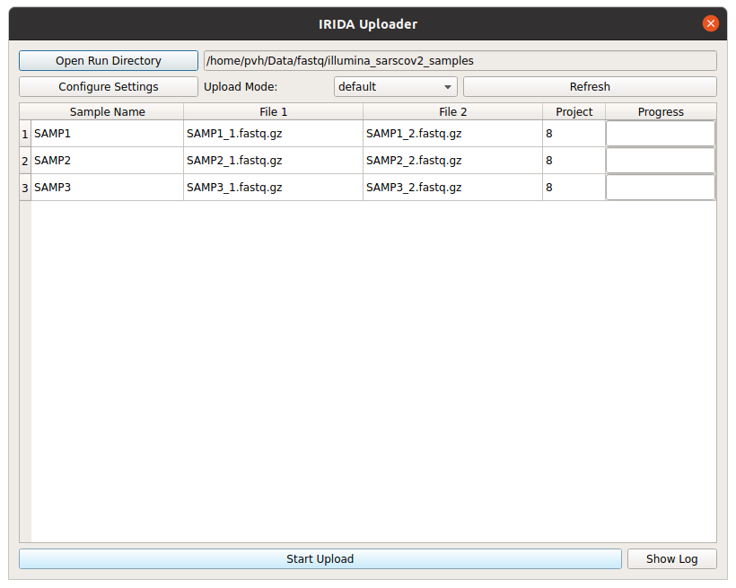

# COMBAT SARS-CoV-2

## Introduction

## Introducting the COMBAT SARS-CoV-2 Workbench Interface

The COMBAT SARS-CoV-2 Workbench is a web application, so to access it you need to know the URL (link)
to the application and also the username and password you will be using to log in. The Workbench
is designed to work with all modern web browsers (for example Firefox, Edge and Chrome).

When you open the COMBAT SARS-CoV-2 Workbench in your web browser you will see a login screen:

<figure>
    
    <figcaption>COMBAT SARS-CoV-2 Workbench Login Page</figcaption>
</figure>

Log in by entering your username and password and you will be directed to this "landing page".

<figure>
    
    <figcaption>COMBAT SARS-CoV-2 Workbench Landing Page</figcaption>
</figure>

This "landing page" displays recent activity on the Workbench server and thus might look a little different when you see it (depending on what has been happening on the server). Across the top of the page you'll see these menus:

* Projects

* Analyses

* Shopping Cart (shopping cart icon)

* Settings (gear icon)

* Help (question mark icon)

* Announcements (bell icon)

* User

The **Projects** menu has two items:

* Your projects

* Synchronise Remote Project

The second of these items allows two or more instances of the Workbench to share data. We will not examine that capability at this time. If you *Your projects* you are presented with a list of projects that you either created or have access to.

## Workbench concepts: Projects

<figure>
    
    <figcaption>COMBAT SARS-CoV-2 Projects Page</figcaption>
</figure>

Each project in the Workbench is used to store a collection of samples with associated metadata. The projects page shows both projects that you created and also projects that your user has access to. In each project, samples are biological sequence samples comprising either paired end (typically Illumina) or single ended (typically Oxford Nanopore) sequence data. Each project has one or more reference genome sequences associated with it as well as settings about data access and sharing.

A new project can be created using the *Create New Project* button, which opens this form:

<figure>
    
    <figcaption>COMBAT SARS-CoV-2 New Project Form</figcaption>
</figure>

Note that on the New Project form, the *Project Organism* drop down uses a limited taxonomic database. Do not be concerned if you get a warning that "The selected organism does not exist in the taxonomy", you can proceed despite this warning.

Watch [this video](https://www.youtube.com/watch?v=_b-A-trnMe8) for an introduction to creating a project and manually adding samples. Manually adding samples is a time consuming process, for high throughput work you will normally want to use the
[irida command line uploader](LINK COMING) to load data into the workbench.

### Loading data using the irida-uploader GUI

As you can see from the video above, loading samples one at a time can be quite time consuming. This is why the Workbench can
accept samples loaded using the *IRIDA uploader*. Documentation on installing and configuring the IRIDA Uploader can be found
[here](irida-uploader-install.md).

The *irida-uploader* can be used both on the command line and as a GUI. Let's focus on using it as a GUI tool.

The starting point for uploading sequence data to the Workbench is an existing project and a correctly configured upload directory.
The Uploader supports reading data from the directory structures created by Illumina MiSeq, MiniSeq and NextSeq runs, as well as uploading samples from a "plain" directory (i.e. one only containing sequence data files and the SampleList.csv). We will focus on uploading from a plain directory.

Creating a project was described above. You need to take note of the Project ID of the project. This a number that is shown in the first column of the *Projects* view which you can find from the navigation menu by selecting *Projects* and then *Your Projects*.

The upload directory should have 1 file per sample for Oxford Nanopore (i.e. MinION, GridION, etc) data and 2 files per samples and it must contain a file named `SampleList.csv` that describes the samples in the directory. The `SampleList.csv` file is a Comma Separated Values file with four columns: Sample_Name, Project_ID, File_Forward and File_Reverse. It also has a first for just containing a call called `[Data]`. A template of this file is available to download <a href="tmpl/SampleList.csv" download>here</a>.
Note that this is *not* in Excel format but rather in CSV (Comma Separated Value) format and each column is separated with commas, not tabs or semicolons.

Here is an example of a SampleList.csv file being edited in LibreOffice Calc (a spreadsheet program):

This is a collection of 3 samples from an Illumina sequencer and is destined for uploading to a project with project ID 8. The corresponding CSV file can  be found <a href="tmpl/CompletedSampleList.csv" download>here</a>.

Once you have your upload directory correctly organised with a SampleList.csv file and the corresponding data files, you can load it into the Uploader by selecting the *Open Run Directory* button and navigating to the upload directory. The Uploader will then read the upload directory and display its contents. You are now ready to start the upload. Here is an example of the samples discussed above, ready for upload.

Click the *Start Upload* button to start uploading. The progress bars will move to 100% and when your upload is complete you will see the samples in the project on the Workbench web interface. As soon as they are uploaded the IRIDA component of the Workbench will start running a sequence quality control check on each sample (using [FastQC](https://www.bioinformatics.babraham.ac.uk/projects/fastqc/)).

For another guide to using the Uploader, consult [this tutorial](https://github.com/phac-nml/irida-uploader-tutorial) by PHAC-NML.

### Copying data from existing projects

In addition to uploading samples, you can copy samples from existing projects. This is useful if you want to re-organise your samples on the Workbench. Before creating a new proejct select an existing project and add from this project samples to the Shopping Cart. (You need to have *Manager* access level to the project to be able to copy samples like this) Then, when creating a new project, in the *Settings* part of the New Project form, there is a checkbox, *Add samples in cart to project*. When this is selected, all the samples that are currently in the Shopping Cart will be copied to the new project (along with their metadata.).

### Reference data

Each project needs at least one reference genome associated with it. To add a reference genome, from the Project view select *Settings* and then *Reference Files*. Then click or drag to upload a file to the project. For SARS-CoV-2 the [NC_045512.2 Wuhan Hu-1](https://www.ncbi.nlm.nih.gov/nuccore/1798174254) reference sequence is most commonly used.

## Running analyses using the Workbench

## Interpreting analysis output results

## Interpreting the “line list” output
