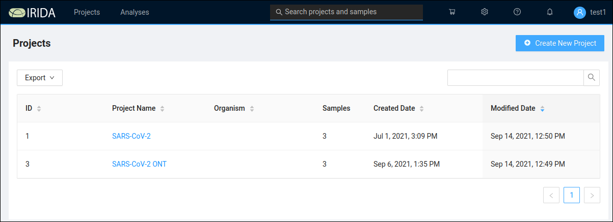

# COMBAT SARS-CoV-2

## Introduction

## Introducting the COMBAT SARS-CoV-2 Workbench Interface

The COMBAT SARS-CoV-2 Workbench is a web application, so to access it you need to know the URL (link)
to the application and also the username and password you will be using to log in. The Workbench
is designed to work with all modern web browsers (for example Firefox, Edge and Chrome).

When you open the COMBAT SARS-CoV-2 Workbench in your web browser you will see a login screen:

<figure>
    
    <figcaption>COMBAT SARS-CoV-2 Workbench Login Page</figcaption>
</figure>

Log in by entering your username and password and you will be directed to this "landing page".

<figure>
    
    <figcaption>COMBAT SARS-CoV-2 Workbench Landing Page</figcaption>
</figure>

This "landing page" displays recent activity on the Workbench server and thus might look a little different when you see it (depending on what has been happening on the server). Across the top of the page you'll see these menus:

* Projects

* Analyses

* Shopping Cart (shopping cart icon)

* Settings (gear icon)

* Help (question mark icon)

* Announcements (bell icon)

* User

The **Projects** menu has two items:

* Your projects

* Synchronise Remote Project

The second of these items allows two or more instances of the Workbench to share data. We will not examine that capability at this time. If you *Your projects* you are presented with a list of projects that you either created or have access to.

## Workbench concepts: Projects

<figure>
    
    <figcaption>COMBAT SARS-CoV-2 Projects Page</figcaption>
</figure>

Each project in the Workbench is used to store a collection of samples with associated metadata. The projects page shows both projects that you created and also projects that your user has access to. In each project, samples are biological sequence samples comprising either paired end (typically Illumina) or single ended (typically Oxford Nanopore) sequence data. Each project has one or more reference genome sequences associated with it as well as settings about data access and sharing.

A new project can be created using the *Create New Project* button, which opens this form:

<figure>
    
    <figcaption>COMBAT SARS-CoV-2 New Project Form</figcaption>
</figure>

Note that on the New Project form, the *Project Organism* drop down uses a limited taxonomic database. Do not be concerned if you get a warning that "The selected organism does not exist in the taxonomy", you can proceed despite this warning.

Watch [this video](https://www.youtube.com/watch?v=_b-A-trnMe8) for an introduction to creating a project and manually adding samples. Manually adding samples is a time consuming process, for high throughput work you will normally want to use the
[irida command line uploader](LINK COMING) to load data into the workbench.

As an alternative to manually adding In the *Settings* part of the New Project form, the *Add samples in cart to project* provides an easy way to move samples between projects when you are creating a new project. Just select an existing project that, add samples to the Shopping Cart and then create a new project using these samples. (You need to have *Manager* access level to the project to be able to copy samples like this)

### Reference data

Each project needs at least one reference genome associated with it. To add a reference genome, from the Project view select *Settings* and then *Reference Files*. Then click or drag to upload a file to the project. For SARS-CoV-2 the [NC_045512.2 Wuhan Hu-1](https://www.ncbi.nlm.nih.gov/nuccore/1798174254) reference sequence is most commonly used.

As mentioned before, you can also import samples from existing projects to new ones.

## Running analyses using the Workbench

## Interpreting analysis output results

## Interpreting the “line list” output
